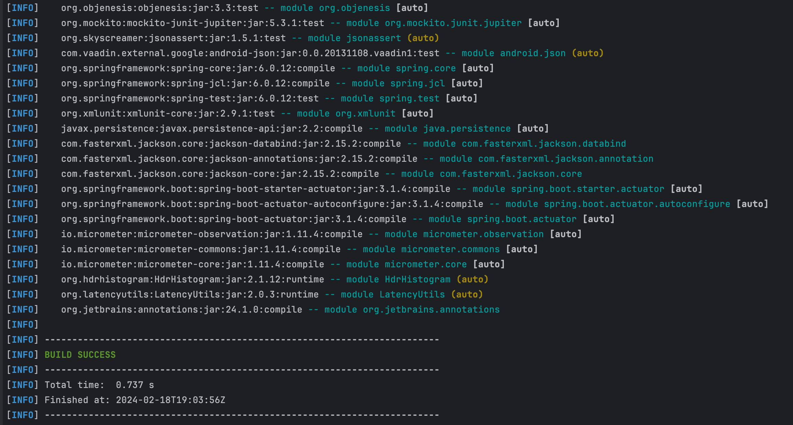
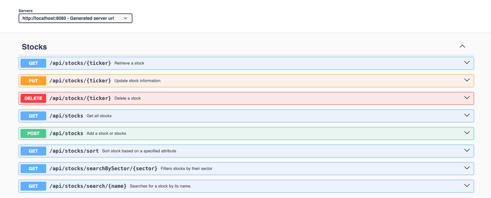
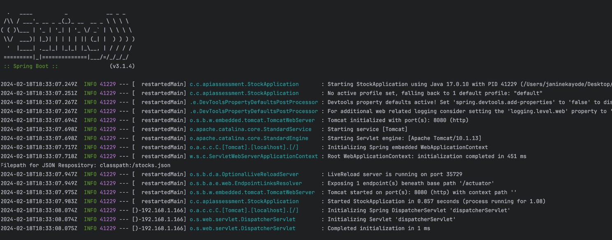

# StockAPI

The StockAPI provides a tool for users track all their stock portfolio in one place. 
It implements a StockRepository using JSON file storage allowing for seamless data persistence. It enables users to:

1) get stock data, including currentPrice, purchasePrice and quantity the stock.
2) use sector based search enhancing usability and efficiency in retrieving relevant stock information.
3) Add, delete, update and view your entire stock portfolio with ease.
4) Incorporates exception handling to gracefully manage error and ensure reliability of the application.


## Table of Contents

1. [Development Setup](#development-setup)
    - [Prerequisites](#prerequisites)
    - [GitHub Instructions](#github-instructions)
        - [Cloning the Repository](#cloning-the-repository)
    - [Local Development](#local-development)
        - [Building and Running the API](#building-and-running-the-api)
        - [Running tests](#running-tests)
2. [Deployment](#deployment)
3. [Versioning](#versioning)
4. [Authors](#authors)
5. [License](#license)

## Development Setup

### Prerequisites

Ensure that you have the following tools installed in your development setup:

- Java: `JDK 17`
- Git
- Springboot
- Jackson
- Maven
- Visual Studio Code:  
  1) Extension Pack for Java,
  2) Sprint Boot Extension Pack
- Alternative to Visual Studio Code is IntelliJ
- Postman or Swagger or other RESTful API testing tool.

### GitHub Instructions

#### Cloning the Repository

Clone this repository to your local machine :
bash 
```
   git clone [REPO_URL]
   cd [REPO_NAME]
```
Replace 'REPO_URL' with the link to your Github repository and 'REPO_NAME' with the repository's name.


#### Building and Running the API

The API can locally be built and run using Maven's wrapper commands:
```
bash 
./mvnw clean dependency:resolve
```
This will take care of downloading dependencies, compiling source code and running unit tests.



#### Running Tests

We use JUnit tests for unit testing. Run them with the following command:
```
bash
 ./mvnw test
 ```

The tests have passed when you have received the following report:


You can test your endpoints using Postman or your preferred REST client.

For POST and PUT requests, you'll need to provide a request body in JSON format, e.g.:
```
    {
        "ticker": "AAA",
        "name": "Apple",
        "currencySymbol": "$",
        "sector": "Technology",
        "currentPrice": 130.75,
        "quantity": 10,
        "purchasePrice": 120.5
    }

```



## Deployment

You should see console output similar to the following (press command + C to exit):


## Responses

Status Codes

| Status Code | Description           | 
|-------------|-----------------------|
| 200         | OK                    | 
| 201         | Created               | 
| 404         | Not Found             |
| 500         | Internal Server Error |


## Versioning

We use Semantic Versioning (SemVer) for versioning. See [SemVer](http://semver.org/) for more details.

## Authors

This API was developed by Janine.

## License

The StockAPI is released under an MIT License.